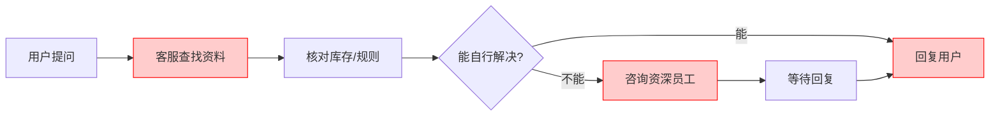
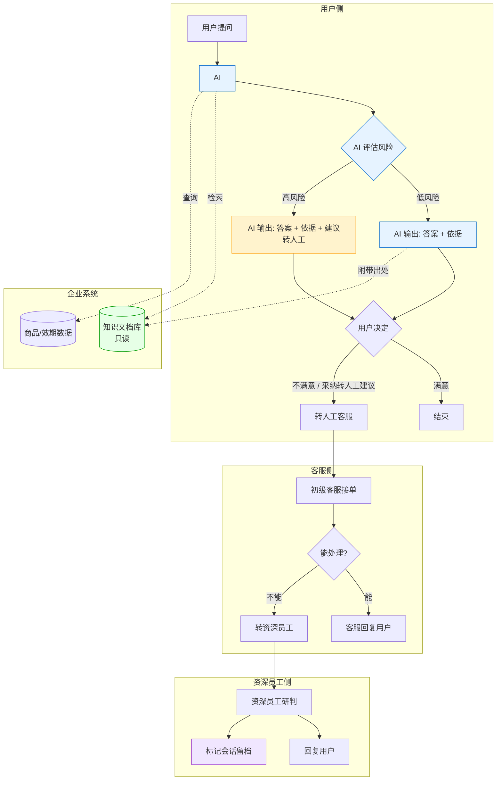

# 业务流程图：美妆零售知识库与客服协作

## 一、AS-IS 现状流程



### 问题环节

| 环节 | 问题 |
|------|------|
| 查找资料 | 知识分散、版本不一致；客服量大没时间细查；部分数据无权限 |
| 咨询资深员工 | 延迟——不一定在线；每次解决的经验不沉淀，下次重来 |
| 回复用户 | 新人缺经验，口径不稳定；忙时高风险问题也可能漏报 |

---

## 二、TO-BE 目标流程



### 角色分工

| 角色 | 干什么 | 不干什么 |
|------|--------|---------|
| **用户** | 提问；收到 AI 建议后自己决定是否转人工 | — |
| **Agent（AI）** | 检索知识库、生成答案+依据、评估风险、建议转人工 | 不编造信息、不做医疗诊断、不修改知识库 |
| **初级客服** | 接收转人工的工单；能处理的直接回复；不能处理的转资深员工 | 不凭经验猜测、不跳过资深员工硬答 |
| **资深员工** | 研判疑难/高风险工单、回复用户、标记新案例会话留档 | 不修改原始知识文档 |
| **企业系统** | 提供知识库和商品数据检索（知识库只读） | — |

### 两级转人工机制

```
第一级（用户侧）：
  AI 评估高风险 → 建议用户转人工 → 用户自己决定

第二级（客服侧）：
  初级客服接到工单 → 无法处理 → 转资深员工
```

### 会话标记（替代知识库修改）

> 原始知识文档只读，不可修改。资深员工处理完新案例后，标记该会话留档。后续遇到同类问题时，可检索历史标记会话作为参考。

### TO-BE 关键变化

| AS-IS | TO-BE |
|------|------|
| 客服自己翻资料 | Agent 秒级检索，直接出答案+依据 |
| 高风险靠客服自觉上报 | AI 自动评估，主动建议转人工 |
| 等资深员工回复 | 初级客服先接，能处理的直接处理，拦截掉一大半 |
| 经验解决完就没了 | 资深员工标记会话留档，可检索复用 |
| 回复口径因人而异 | 所有答案绑定统一知识库依据 |
